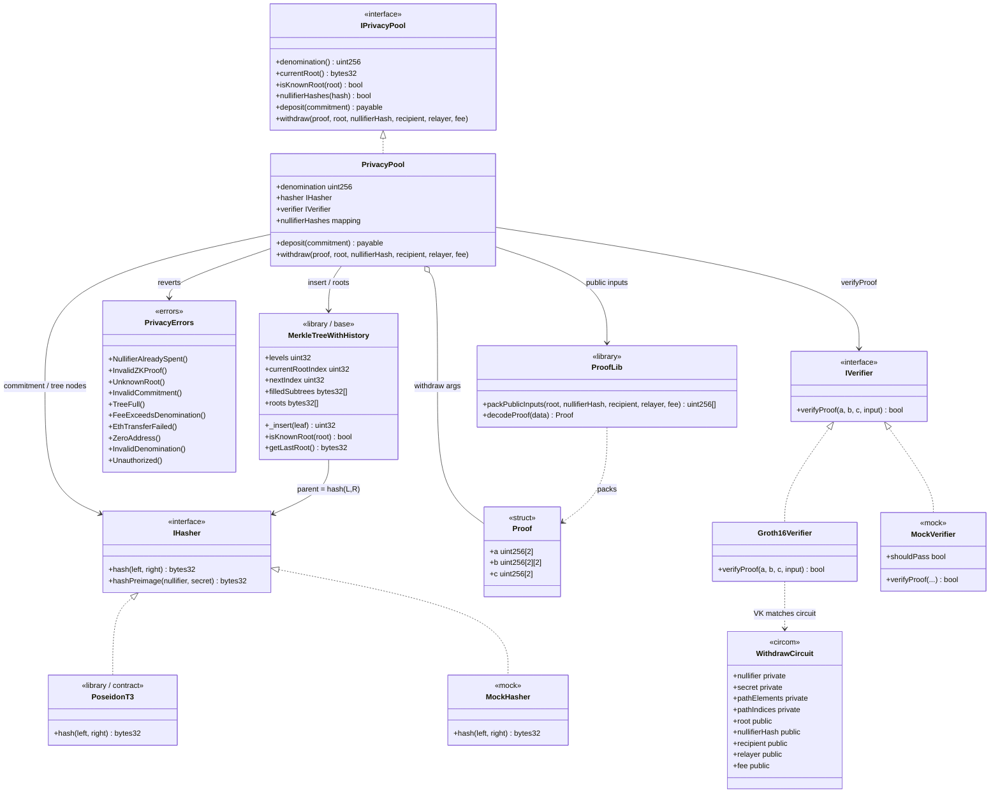

# Diagrama de clases — ZK-SNARKs & Privacy Protocols

Vista estructural propuesta de contratos, circuitos, librerías e interfaces (módulo 17, **planificación v1**).

## Diagrama (Mermaid)

---

## Relaciones clave

| Relación | Descripción |
|----------|-------------|
| Pool → Hasher | `commitment` off-chain; nodos on-chain con el mismo Poseidon |
| Pool → MerkleTreeWithHistory | Cada deposit inserta leaf y registra root en historial |
| Pool → Verifier | Solo withdraw con proof Groth16 válida |
| Pool → nullifierHashes | Un nullifierHash = un withdraw (anti double-spend) |
| Circuito → Verifier | Misma VK; señales públicas deben casar 1:1 con args de withdraw |
| Relayer | No es contrato: EOA que llama `withdraw` y recibe `fee` |

---

## Notas de diseño

- `ReentrancyGuard` en `deposit` / `withdraw`; CEI: marcar nullifier **antes** de `.call` ETH.
- Denomination `immutable` para gas y anonymity set fijo.
- `isKnownRoot` debe aceptar raíces anteriores (nuevos deposits no invalidan proofs en vuelo).
- El circuito vive off-chain (`circuits/`); on-chain solo la VK embebida en `Groth16Verifier`.
- Detalle de flujos: [`diagrama-de-flujo.md`](./diagrama-de-flujo.md) · ciclo e2e: [`flujograma.md`](./flujograma.md).
