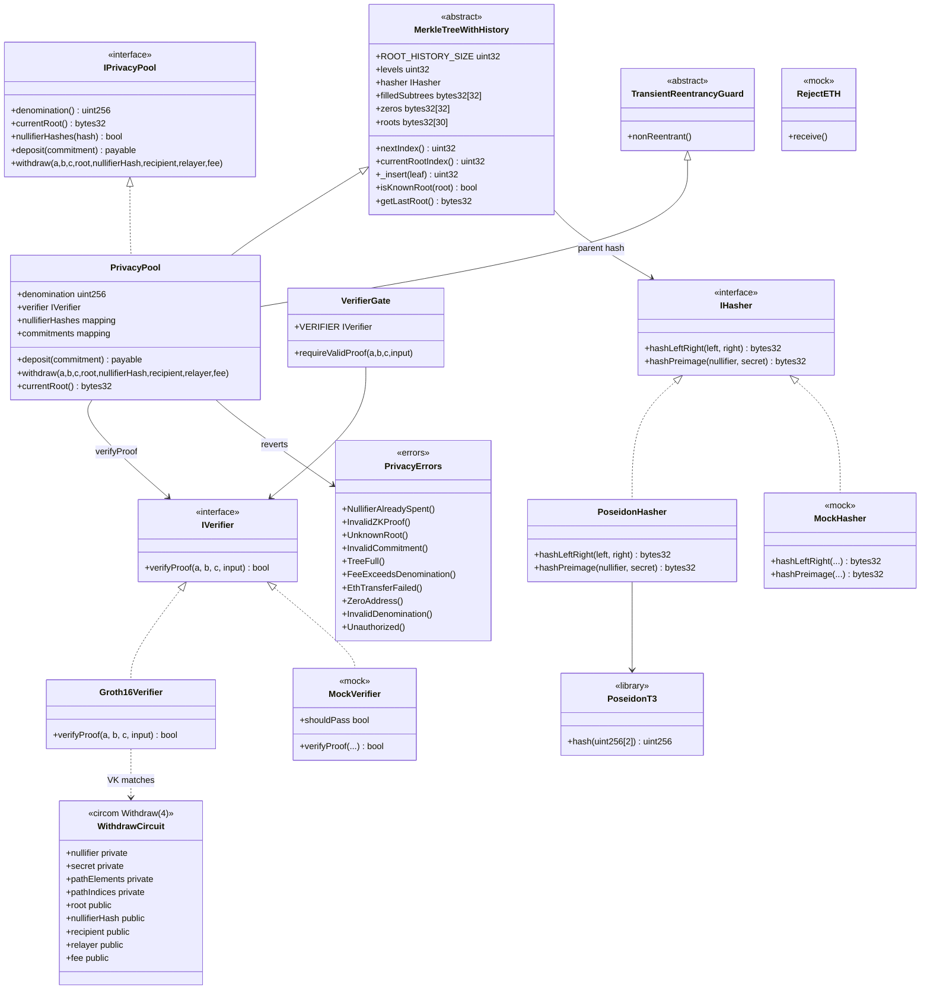

# Diagrama de clases — ZK-SNARKs & Privacy Protocols

Vista estructural de contratos, circuitos, librerías e interfaces (módulo 17, **v1 implementado**).  
**Sync:** 2026-09-13 · Suite **65 PASS**.

## Diagrama (Mermaid)

---

## Relaciones clave

| Relación | Descripción |
|----------|-------------|
| Pool → Hasher | Nodos on-chain Poseidon; commitment off-chain |
| Pool → MerkleTreeWithHistory | Deposit inserta leaf; ring de 30 roots |
| Pool → Verifier | Withdraw solo con Groth16 válida |
| Pool → nullifierHashes | Un hash = un withdraw |
| Circuito → Verifier | 5 públicos en el mismo orden |
| Relayer | EOA/`msg.sender` de withdraw; recibe `fee` |

---

## Notas de diseño

- `TransientReentrancyGuard` (Cancun) + CEI: nullifier **antes** de ETH Yul `call`.
- Merkle: arrays fijos + `_packedIndices` (no mappings de índices).
- Lab: **levels = 4**; cambiar circuito + re-exportar VK para otra profundidad.
- Suite: **65 PASS**. [`GAS.md`](./GAS.md) · [`SWC-AUDIT.md`](./SWC-AUDIT.md) · flujos: [`diagrama-de-flujo.md`](./diagrama-de-flujo.md) / [`flujograma.md`](./flujograma.md).
