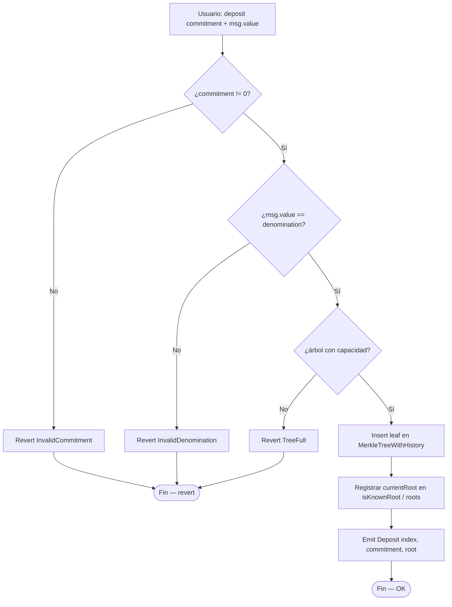
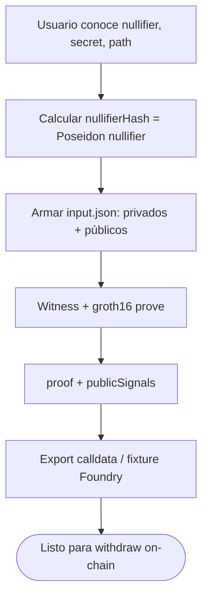
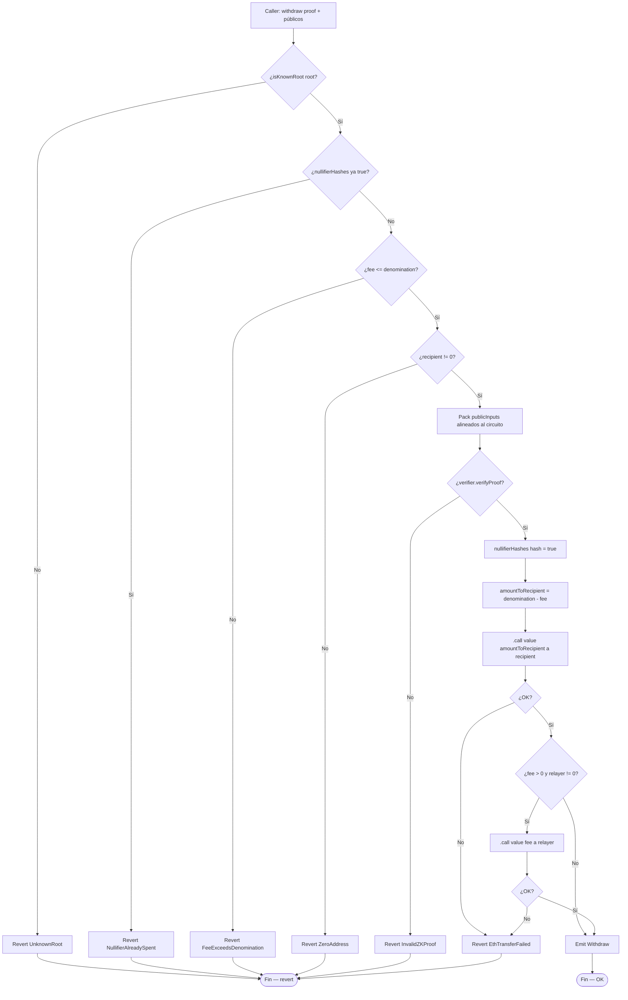
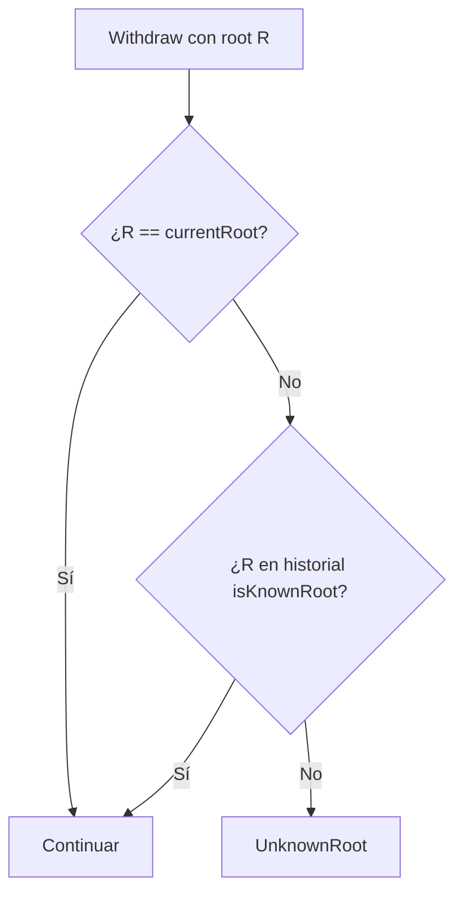
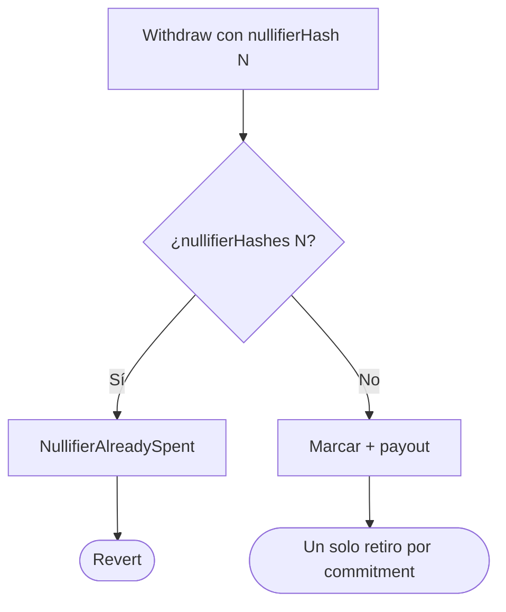
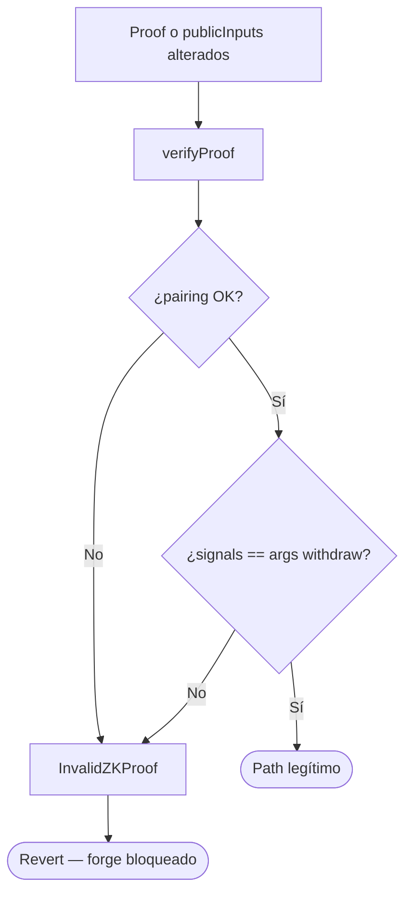
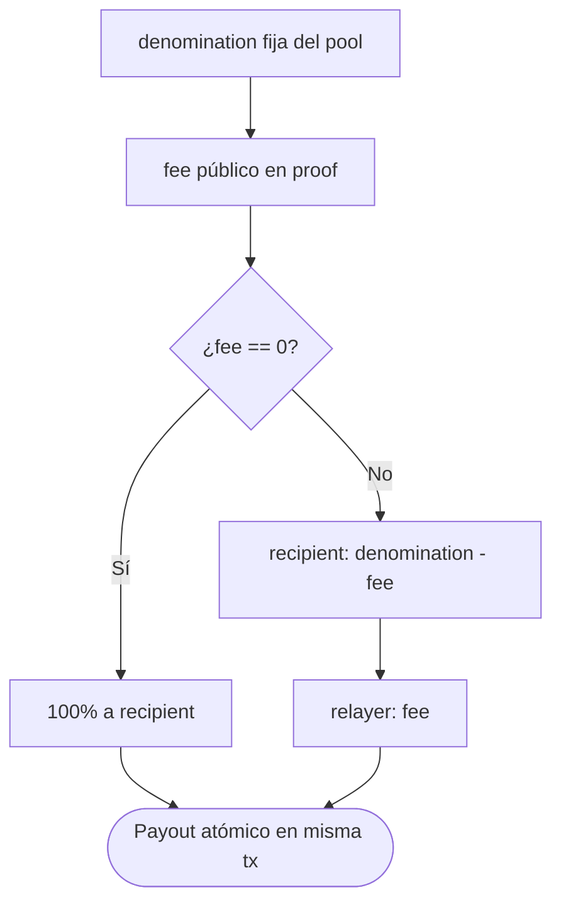

# Diagrama de flujo — Deposit, prove y withdraw

Flujos de decisión internos del pool, Merkle tree y verificación ZK (módulo 17, **planificación v1**).

## 1. deposit (commitment + Merkle)

> El `commitment = Poseidon(nullifier, secret)` se calcula **off-chain**; on-chain solo se inserta el leaf.

---

## 2. Generación de proof (off-chain — Circom / SnarkJS)

---

## 3. withdraw (root → proof → nullifier → payout)

> CEI: marcar `nullifierHashes` **antes** de las transferencias ETH.

---

## 4. Validación de raíz histórica

---

## 5. Anti double-spend (nullifier)

---

## 6. Proof inválida / tampered

---

## 7. Relayer fee split

