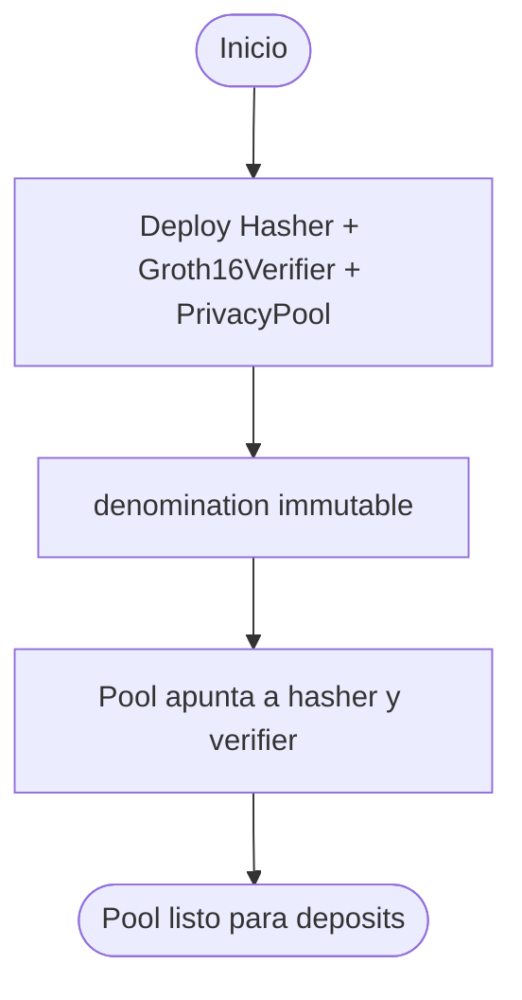
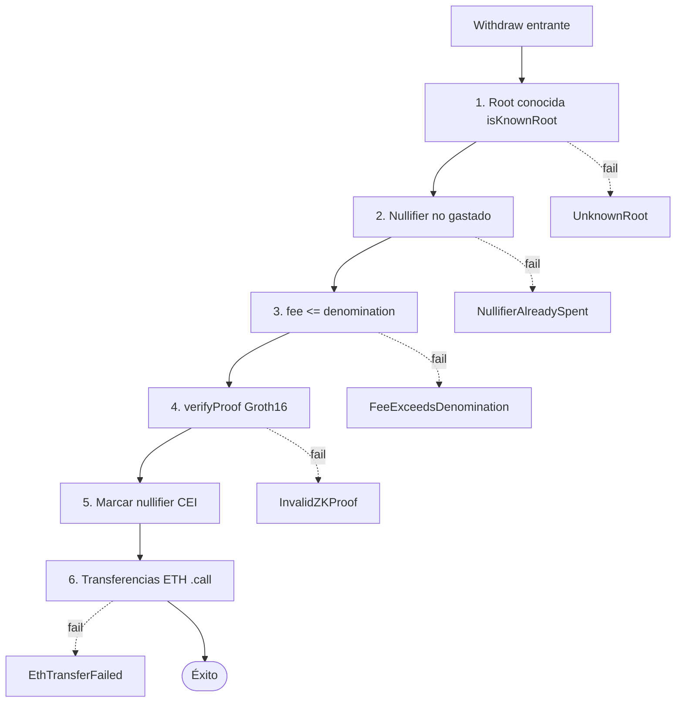
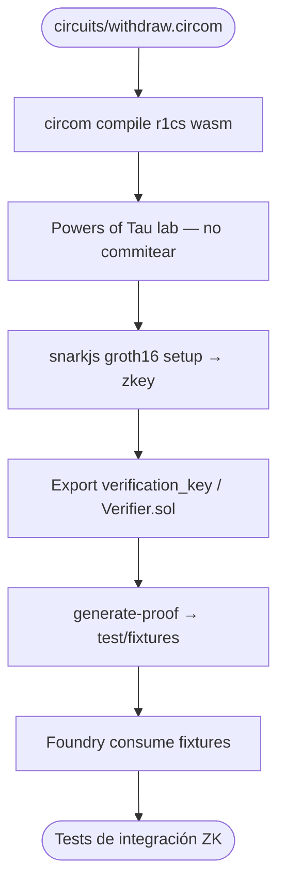
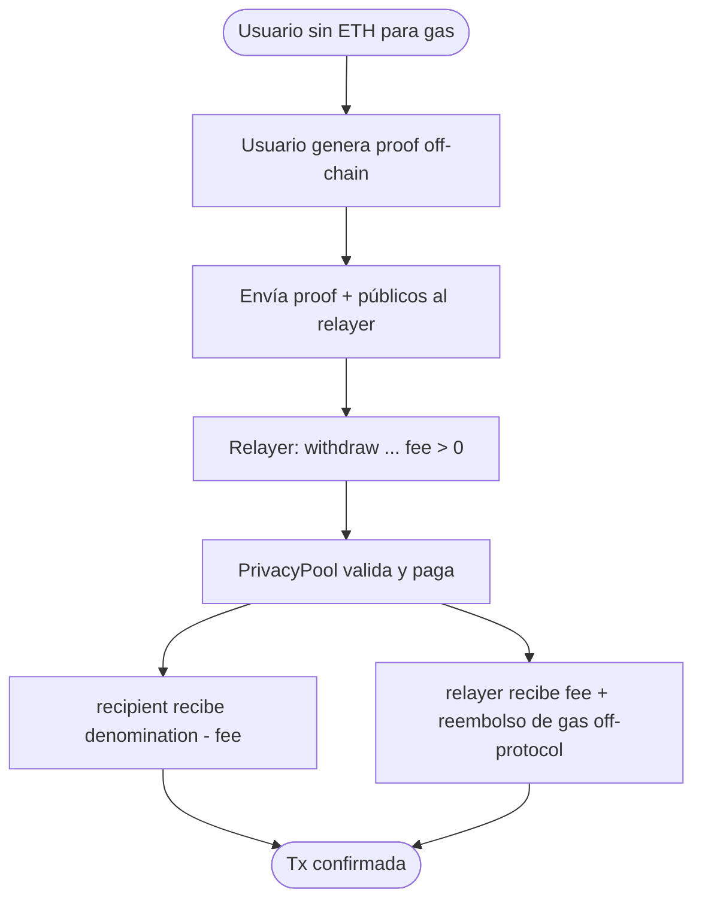

# Flujograma — Ciclo completo Privacy Pool (ZK-SNARKs)

Flujo extremo a extremo entre usuarios, circuito, pool, verifier y relayer (módulo 17, **planificación v1**).

## Actores

| Actor | Rol |
|-------|-----|
| Depositor | Genera `(nullifier, secret)`, calcula commitment, llama `deposit` |
| Withdrawer | Construye witness + proof Groth16; llama `withdraw` (o pide a relayer) |
| Relayer | Paga gas; recibe `fee`; entrega proof en nombre del usuario |
| PrivacyPool | Inserta leaves, guarda roots/nullifiers, verifica proof, paga ETH |
| Groth16Verifier | Pairing Alt_BN128 (`ecPairing` `0x08`) |
| Circom / SnarkJS | Compila circuito, genera proof y VK |
| Admin / owner | Deploy denomination, hasher, verifier (mínimo en v1) |
| CI / Foundry | Unit, fixtures de proof, fuzz Merkle, gas |

---

## Flujograma — Deploy

---

## Flujograma principal — Deposit → Prove → Withdraw

---

## Flujograma — Capas de defensa en withdraw

---

## Flujograma — Toolchain circuito (lab)

---

## Flujograma — Relayer gasless

---

## Matriz de caminos felices / fallo

| Escenario | Resultado esperado |
|-----------|-------------------|
| Deposit con `msg.value == denomination` | Leaf insertado + `Deposit` |
| Withdraw proof válida + root histórica | Payout + nullifier marcado |
| Mismo `nullifierHash` dos veces | `NullifierAlreadySpent` |
| Root nunca vista | `UnknownRoot` |
| Proof / signals alterados | `InvalidZKProof` |
| `fee > denomination` | `FeeExceedsDenomination` |
| `msg.value != denomination` en deposit | `InvalidDenomination` |

---

## Relación con otros diagramas

- Estructura de tipos: [`diagrama-de-clases.md`](./diagrama-de-clases.md)
- Decisiones internas detalladas: [`diagrama-de-flujo.md`](./diagrama-de-flujo.md)
- Fases y gates: [`planificacion.md`](./planificacion.md)
