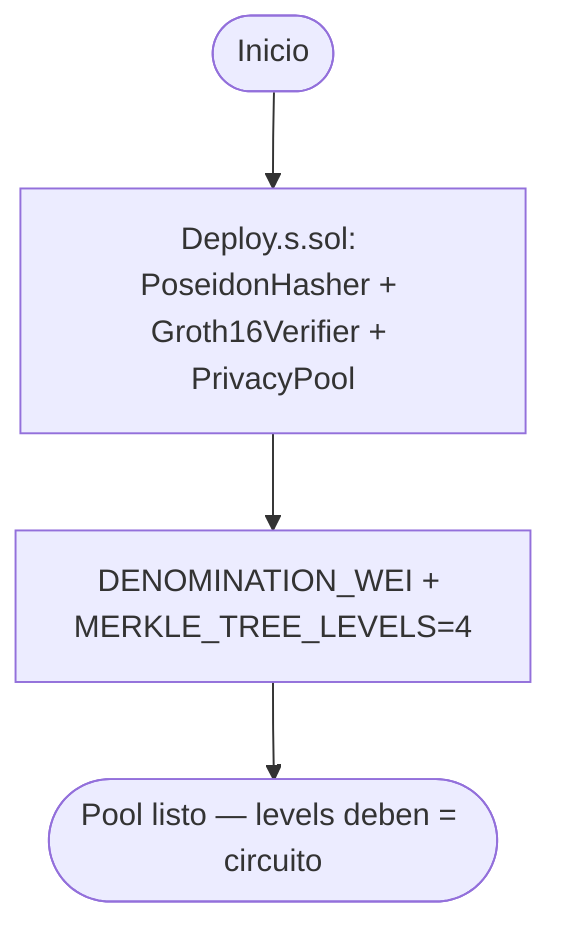
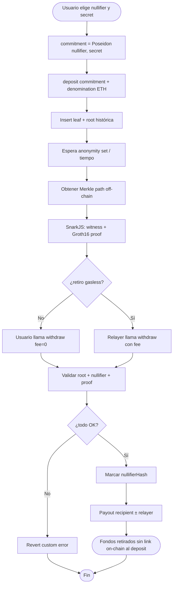
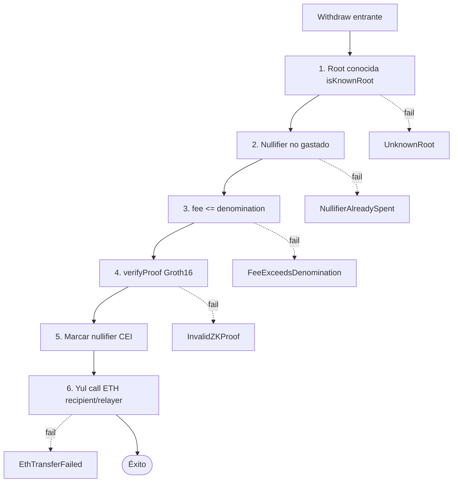
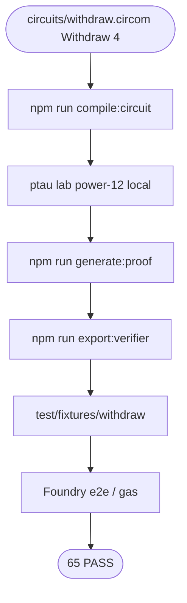
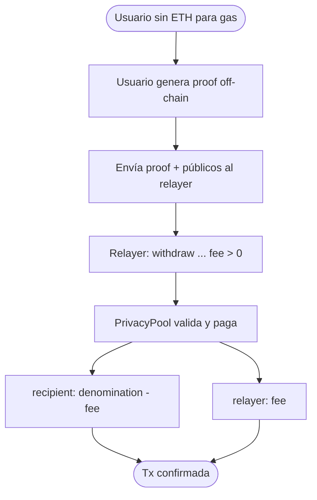

# Flujograma — Ciclo completo Privacy Pool (ZK-SNARKs)

Flujo extremo a extremo entre usuarios, circuito, pool, verifier y relayer (módulo 17, **v1 implementado**).  
**Sync:** 2026-09-13 · **65 PASS**.

## Actores

| Actor | Rol |
|-------|-----|
| Depositor | Genera `(nullifier, secret)`, calcula commitment, llama `deposit` |
| Withdrawer | Witness + proof Groth16; llama `withdraw` (o vía relayer) |
| Relayer | Paga gas; recibe `fee` ligado al proof |
| PrivacyPool | Leaves, roots, nullifiers, verify, payout Yul |
| Groth16Verifier | Pairing Alt_BN128 (`ecPairing` `0x08`) |
| Circom / SnarkJS | `Withdraw(4)`, fixtures, export VK |
| Deployer | `Deploy.s.sol`: hasher + verifier + pool |
| CI / Foundry | Unit, fuzz, gas snapshot, e2e fixture |

---

## Flujograma — Deploy

---

## Flujograma principal — Deposit → Prove → Withdraw

---

## Flujograma — Capas de defensa en withdraw

---

## Flujograma — Toolchain circuito (lab)

---

## Flujograma — Relayer gasless

---

## Matriz de caminos felices / fallo

| Escenario | Resultado esperado |
|-----------|-------------------|
| Deposit con `msg.value == denomination` | Leaf insertado + `Deposit` |
| Withdraw proof válida + root histórica | Payout + nullifier marcado |
| Mismo `nullifierHash` dos veces | `NullifierAlreadySpent` |
| Root nunca vista | `UnknownRoot` |
| Proof / signals alterados | `InvalidZKProof` |
| `fee > denomination` | `FeeExceedsDenomination` |
| Recipient/relayer rechaza ETH | `EthTransferFailed` |

---

## Relación con otros diagramas

- Estructura de tipos: [`diagrama-de-clases.md`](./diagrama-de-clases.md)
- Decisiones internas: [`diagrama-de-flujo.md`](./diagrama-de-flujo.md)
- Fases / gas / SWC: [`planificacion.md`](./planificacion.md) · [`GAS.md`](./GAS.md) · [`SWC-AUDIT.md`](./SWC-AUDIT.md)
- Índice: [`README.md`](./README.md)
